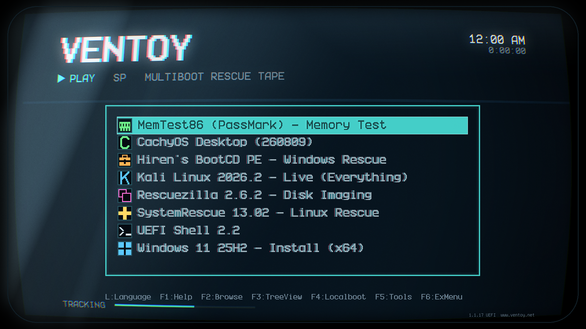

# Ventoy VCR theme

A retro VCR theme for [Ventoy](https://www.ventoy.net): CRT phosphor on black,
scanlines, chromatic fringing, and 16x16 pixel icons.



## Install the theme

1.  Copy the `theme` directory to the first partition of your Ventoy drive, so
    that `theme.txt` is at `/ventoy/theme/theme.txt`.
2.  Merge the `theme` block from `ventoy.json.example` into
    `/ventoy/ventoy.json`. If that file doesn't exist yet, copy the example and
    rename it.
3.  Boot the drive.

The `fonts` array is required. Without it, GRUB falls back to its default font
and reports no error.

## Assign icons

The `menu_class` plugin maps images to icons, where `class` refers to
`theme/icons/<class>.png`:

```json
{ "key": "systemrescue", "class": "sysrescue" }
```

`key` matches a case-sensitive substring of the filename. Prefer it over `dir`,
which does not match `.efi` entries.

Available classes: `kali`, `cachyos`, `windows`, `hirens`, `sysrescue`,
`rescuezilla`, `uefishell`, `memtest`, and `vtoyiso`.

## Rebuild the assets

The `src` directory regenerates everything. It requires Python 3,
[Pillow](https://python-pillow.org/), and the Better VCR font. See
[ATTRIBUTION.md](ATTRIBUTION.md).

```bash
python3 src/mkfont.py BetterVCR_25.09.ttf 32 "Better VCR 32" vcr-32.pf2 3
python3 src/mkart.py
python3 src/mkchroma.py src/theme.base.txt theme/theme.txt 2
```

`mkfont.py` writes GRUB PF2 bitmap fonts and works as a standalone replacement
for `grub-mkfont`. `mkart.py` renders the background and the 9-slice panels;
its CRT settings are constants at the top of the file. `mkchroma.py` expands a
single-menu `theme.base.txt` into the three overlapping menus that produce the
chromatic fringing.

Edit `theme.base.txt` and regenerate. Don't edit the three `boot_menu` blocks in
`theme/theme.txt` directly.

## License

Artwork, `theme.txt`, and the scripts are MIT licensed. See [LICENSE](LICENSE).

The `.pf2` files are bitmaps derived from Better VCR and remain under the SIL
Open Font License 1.1. See [ATTRIBUTION.md](ATTRIBUTION.md).
